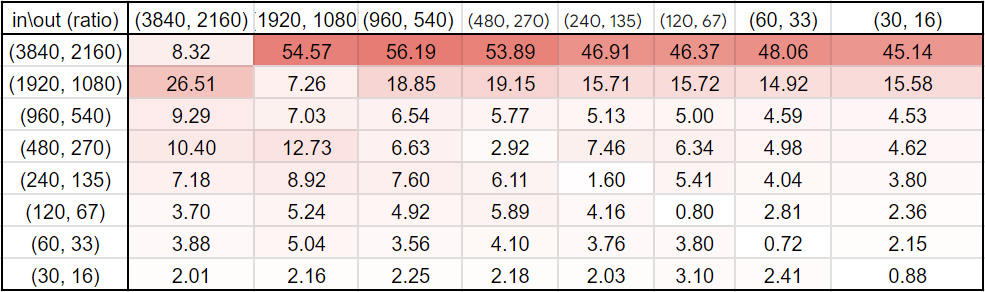

# Cupy, CUDA Bilinear interpolation

Ultra fast Bilinear interpolation in image resize with CUDA.


`lerp.py` : Concept and code base (*single thread, may take a while to run). <br/>
`resize_ker.cu` : CUDA test case in `C`. <br/>
`resize.py` : Cupy example <br/>

(*PyCUDA(deprecated) is no longer support , use cupy instead )

Requirements:
>- GPU (compute capability: 3.0 or above, testing platform: 7.5)
>- CUDA driver
>- Docker and nvidia docker
---
Pros:
- support Batch image.
- no shared object .so and .dll binary file
- Install cupy and use
- Compatible to `Numpy` library
- pass the GPU array to TensorRT directly.

Cons:
- still need the concept of CUDA programming
- SourceModule have to write in C CUDA, including all CUDA kernel and device code

---
### Quick Start

```bash
# Pull docker image
docker run -it --runtime=nvidia royinx/cuda_resize bash

# For Cupy implementation
python3 resize.py

# For concept
python3 lerp.py

# For CUDA kernel testing
nvcc resize_free.cu -o resize_free.o && ./resize_free.o

# For benmarking
wget http://images.cocodataset.org/zips/val2017.zip
python3 benchmark.py
```

<details><summary> Build </summary>

```bash
git clone https://github.com/royinx/CUDA_Resize.git
cd CUDA_Resize
docker build -t lerp_cuda .
docker run -it --runtime=nvidia -v ${PWD}:/py -w /py lerp_cuda bash
```
</details>

<details><summary> Advance Metrics </summary>

```bash
docker run -it --privileged --runtime=nvidia -p 20072:22 -v ${PWD}:/py -w /py lerp_cuda bash
sh -c 'echo 1 >/proc/sys/kernel/perf_event_paranoid'
nvcc resize_free.cu -o resize_free.o
nsys profile ./resize_free.o

ncu -o metrics /bin/python3 resize_free.py  > profile_log
ncu -o metrics /bin/python3 resize_free.py
```
Remark: Development platform is in dockerfile.opencv with OpenCV in C for debugging

Function Working well in pycuda container, you dont need to build OpenCV.
</details>

---

### Benchmark
#### AWS g4dn.xlarge (Tesla T4)
> ratio = T4 (ms) per img / Xeon Platinum 8259CL (ms) per img


> (ms) per img on T4


#### 2080ti
> ratio = 2080ti (ms) / Ryzen 3950x (ms)

